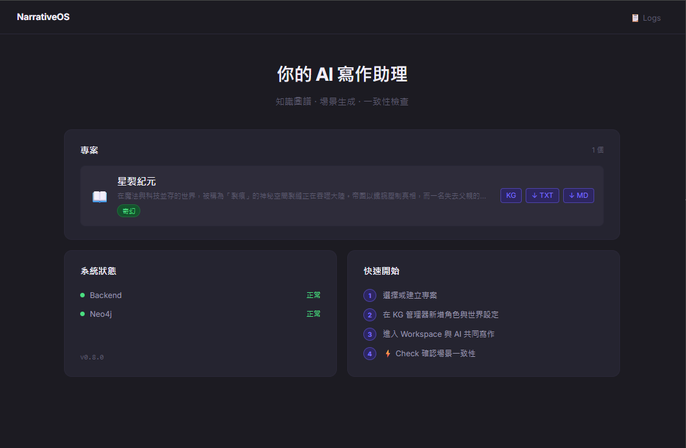
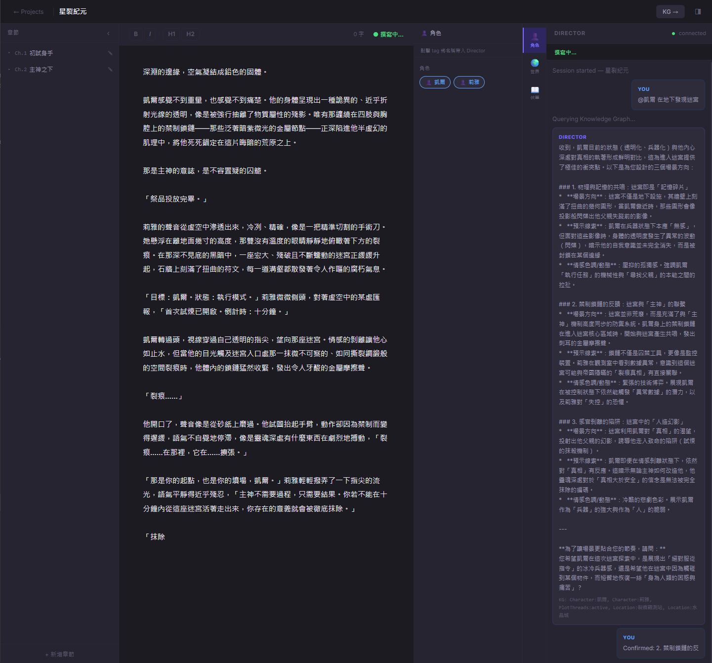
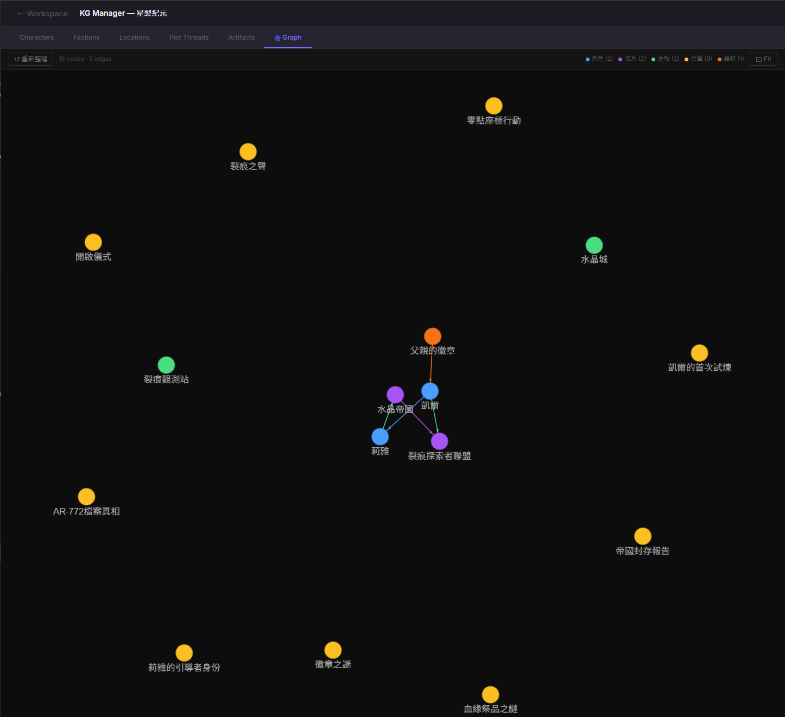
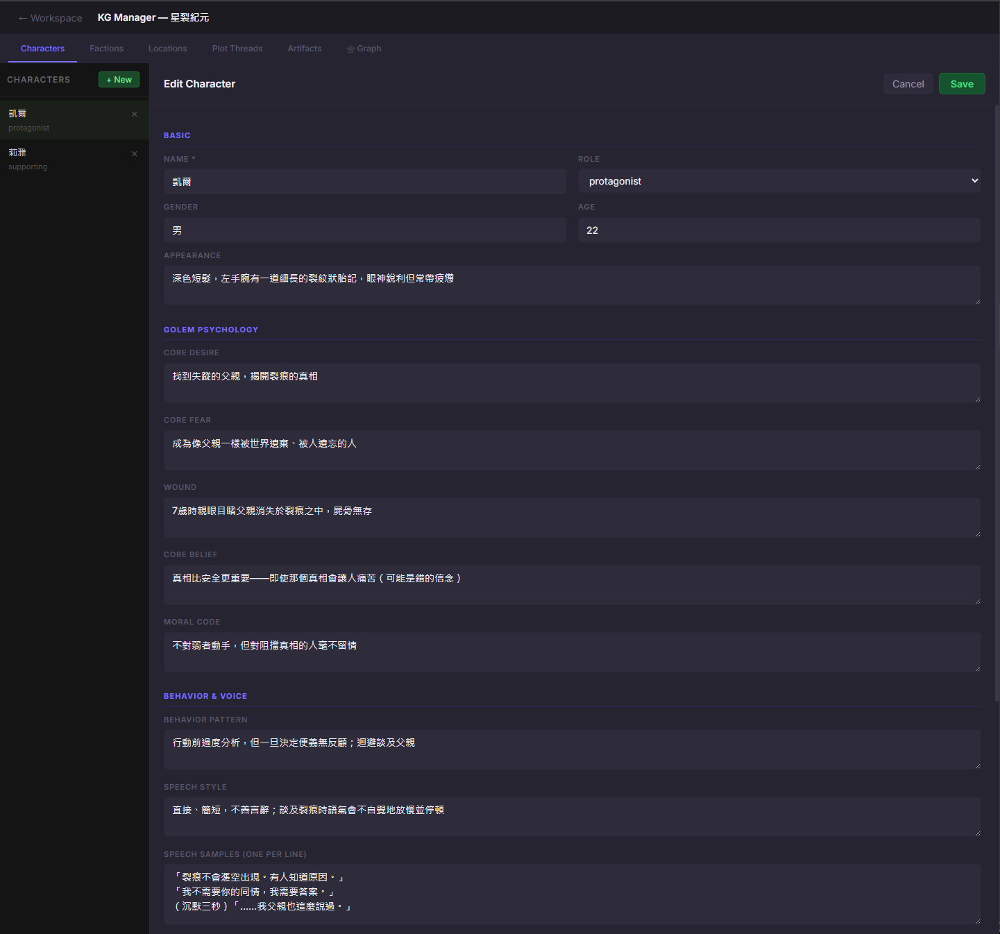
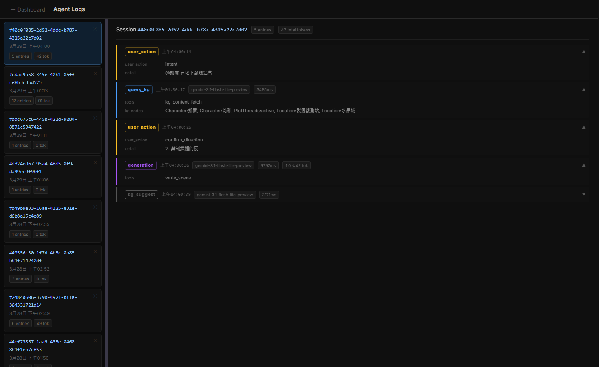

# NarrativeOS

> An AI-assisted novel writing system — outline, generate, and maintain story consistency with a Knowledge Graph at its core.



---

## ✨ Features

- **Director AI** — Chat with an AI director that understands your story's characters, world, and ongoing plot threads via a Knowledge Graph
- **AI Scene Generation** — Stream full scene drafts directly into the rich-text editor
- **Knowledge Graph (KG)** — Track characters (with Golem Psychology profiles), factions, locations, artifacts, and plot threads in Neo4j
- **KG Context Panel** — VS Code-style side panels; click entity tags to inject `@names` into the Director chat
- **Consistency Check** — One-click scene analysis that flags contradictions against your KG
- **Chapter & Scene Management** — Organize your manuscript with chapters (outline, tags, POV, status) and scenes; auto-save with 2s debounce
- **Agent Log Viewer** — Full timeline of every LLM call, token usage, and action taken per session
- **Export** — Download your project as `.txt` or `.md`
- **MCP Server** — Expose your story KG as tools for external AI agents

---

## 📸 Screenshots

### Workspace
*Chapter tree · Rich-text editor · Director chat · KG context panel*



### KG Context Panel
*Click any entity tag to inject it into the Director conversation*



### Knowledge Graph Manager
*Deep character profiles with Golem Psychology — desire, fear, wound, belief, moral code*



### Agent Log Viewer
*Full audit trail of every LLM call, model used, latency, and token cost*



---

## 🏗 Architecture

```
narrative-os/
├── agent/          # LLM pipeline (director, writer, consistency, summary)
├── backend/        # FastAPI + WebSocket server
│   └── routes/     # chapters, scenes, KG, export, logs, analysis
├── frontend/       # React + TypeScript (Vite)
│   └── src/
│       ├── pages/      # Dashboard, Workspace, KGManager, LogViewer
│       └── components/ # ChapterTree, EditorPane, AgentChat, KGContextPanel …
├── kg/             # Neo4j / Graphiti schema, CRUD, client
├── mcp_server/     # FastMCP server exposing KG tools
└── scripts/        # CLI, seed data, test tools
```

**Data flow:**

```
User → WebSocket → NarrativeLoop → Director Agent → LiteLLM → Gemini
                                 ↓
                          KG Query (Neo4j)
                                 ↓
                    Scene Writer → streaming chunks → Editor
                                 ↓
                    KG Updater → Consistency Checker
```

---

## 🚀 Quick Start

### Prerequisites

- Python 3.11+
- Node.js 18+
- Neo4j 5.x (local or Docker)
- A Gemini API key (or any LiteLLM-compatible provider)

### 1. Clone & configure

```bash
git clone https://github.com/<your-username>/narrative-os.git
cd narrative-os
cp .env.example .env
# Edit .env with your API keys and Neo4j credentials
```

### 2. Start Neo4j (Docker)

```bash
docker compose up neo4j -d
```

Or use [Neo4j Desktop](https://neo4j.com/download/) with password `narrativeos`.

### 3. Backend

```bash
python -m venv .venv
source .venv/bin/activate  # Windows: .venv\Scripts\activate
pip install -r requirements.txt
cd backend
uvicorn main:app --reload --port 8000
```

### 4. Frontend

```bash
cd frontend
npm install
npm run dev
# → http://localhost:5173
```

### 5. Seed test data (optional)

```bash
python scripts/seed_test_data.py
```

---

## ⚙️ Configuration

All model assignments are in `agent/config.py`:

```python
TASK_MODEL_MAP = {
    "director":    "gemini/gemini-2.5-flash-lite-preview",
    "write_scene": "gemini/gemini-2.5-flash-lite-preview",
    "consistency": "gemini/gemini-2.5-flash-lite-preview",
    # ... swap for any LiteLLM-supported model
}
```

Supports any model via [LiteLLM](https://docs.litellm.ai/docs/providers) — OpenAI, Anthropic, Gemini, local Ollama, etc.

---

## 🛠 Tech Stack

| Layer | Technology |
|-------|-----------|
| Frontend | React 18, TypeScript, Vite, TipTap, Zustand |
| Backend | FastAPI, Uvicorn, WebSockets |
| Database | Neo4j 5 + Graphiti |
| LLM | LiteLLM (Gemini / OpenAI / Anthropic) |
| MCP | FastMCP |
| Styling | Custom design tokens (Linear-inspired dark theme) |

---

## 📋 API Overview

| Endpoint | Description |
|----------|-------------|
| `WS /ws/{project_id}` | Main agent session (bidirectional) |
| `GET /api/projects` | List all projects |
| `GET/POST /api/projects/{id}/chapters` | Chapter management |
| `GET/POST /api/chapters/{id}/scenes` | Scene management |
| `GET /api/projects/{id}/kg/*` | KG entities (characters, factions, …) |
| `POST /api/projects/{id}/consistency` | Run consistency check |
| `GET /api/projects/{id}/export?format=txt\|md` | Export manuscript |
| `GET /api/logs` | List agent sessions |

---

## 🗺 Roadmap

- [ ] Multi-project timeline view
- [ ] POV-aware scene suggestions
- [ ] Chapter summary auto-generation
- [ ] KG graph visualization (force-directed)
- [ ] Collaborative editing (multi-user WebSocket)
- [ ] Local model support (Ollama first-class)

---

## 📄 License

MIT
